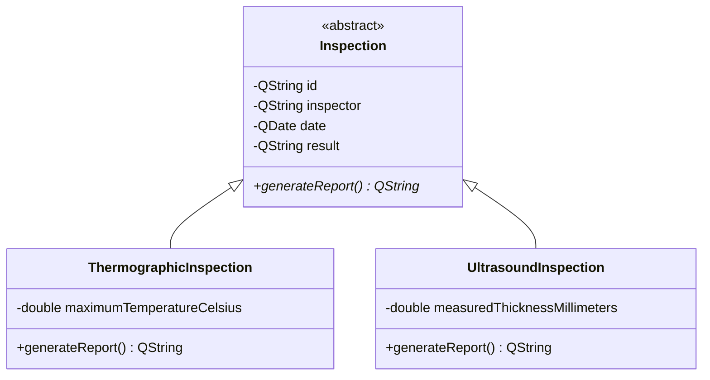
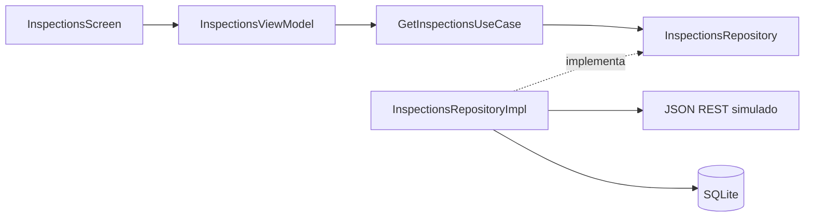

# Respostas - Prova Subiter Rev. 1

## 1. Gerenciamento de inspeções industriais em C++ e Qt

A classe abstrata `Inspection` encapsula ID, inspetor, data e resultado, e
declara o contrato polimórfico `generateReport()`. `ThermographicInspection` e
`UltrasoundInspection` adicionam seus dados específicos e sobrescrevem somente
a geração do relatório. O consumidor depende de `Inspection`, permitindo criar
novos tipos sem alterar os tipos existentes.



Aplicações de SOLID/POO: encapsulamento dos atributos, polimorfismo para o
relatório, SRP em cada modalidade, OCP para novas modalidades, LSP no uso de
`Inspection` e DIP nos consumidores. A implementação completa está em
[`questao_1.cpp`](questao_1.cpp).

## 2. Tela Flutter para listar inspeções consumindo uma API REST simulada

A entrega usa `assets/mocks/inspections.json` como resposta de uma API REST. O
arquivo possui envelope HTTP simulado:

```json
{
  "statusCode": 200,
  "message": "Inspeções carregadas com sucesso",
  "data": {
    "inspections": []
  }
}
```

Cada item contém `id`, `type`, `inspector`, `date`, `result`, `equipment`,
`location`, `summary` e `measurement`. Assim, o exercício reproduz o contrato e
o parsing de uma API sem depender de servidor ou conexão externa.

O módulo segue o padrão do `precificakm-mobile`:

```text
lib/modules/inspections/
  inspections_routes.dart
  domain/
    enums/
    models/
    repositories/
    usecases/
  infra/
    data_models/
    data_sources/
    repositories/
  ui/
    inspections_screen.dart
    inspections_viewmodel.dart
    widgets/inspection_card.dart
```

### Separação entre interface e lógica

- `InspectionsScreen` e `InspectionCard` apenas renderizam e encaminham ações.
- `InspectionsViewModel` coordena o carregamento e expõe estado e dados.
- `GetInspectionsUseCase` representa o caso de uso da aplicação.
- `InspectionsRepository` é o contrato do domínio.
- `JsonInspectionsRemoteDataSource` lê e valida o JSON como resposta REST.
- `InspectionDataModel` adapta o payload para `InspectionModel`, evitando que
  detalhes externos vazem para a interface.
- `InspectionsRepositoryImpl` coordena a fonte simulada e o cache SQLite.

Fluxo de dependências:



As dependências apontam para as abstrações do domínio. A tela não importa o
data source, o modelo de infraestrutura ou o banco de dados.

### Gerenciamento de estado

O ViewModel estende `ChangeNotifier`, é fornecido por `Provider` e expõe os
estados `initial`, `loading`, `success`, `empty` e `error`. A tela usa
`Consumer<InspectionsViewModel>` e mostra progress indicator, lista,
estado vazio ou erro. O pull-to-refresh chama `getInspections()` novamente.

```dart
Future<void> getInspections() async {
  if (isLoading) return;

  _state = InspectionsViewState.loading;
  notifyListeners();

  try {
    final response = await _getInspectionsUseCase();
    _inspections = response.inspections;
    _isFromCache = response.fromCache;
    _state = _inspections.isEmpty
        ? InspectionsViewState.empty
        : InspectionsViewState.success;
  } on Object {
    _state = InspectionsViewState.error;
  }

  notifyListeners();
}
```

### Tratamento de erros

- O data source valida status HTTP simulado, envelope, lista e campos obrigatórios.
- Payload inválido é convertido em `DataException` dentro da infraestrutura.
- Se a leitura simulada falhar, o repositório tenta o cache SQLite.
- Se não existir cache, o ViewModel converte a falha em estado `error`.
- A tela exibe mensagem amigável e o botão “Tentar novamente”; nenhuma exceção
  técnica chega aos widgets.

No carregamento bem-sucedido, o repositório substitui o conteúdo da tabela
`inspections`. O objeto `InspectionsResult` informa se a resposta veio do cache,
permitindo que a interface apresente o aviso “Exibindo os dados salvos no
dispositivo”.

```dart
try {
  final response = await _remoteDataSource.getInspections();
  await _localDataSource.replaceInspections(response);
  return InspectionsResult(_toDomain(response), fromCache: false);
} on Object {
  final cached = await _localDataSource.getInspections();
  if (cached.isEmpty) rethrow;
  return InspectionsResult(_toDomain(cached), fromCache: true);
}
```

Trocar o JSON por uma API real exige somente outra implementação de
`InspectionsRemoteDataSource`, preservando UI, ViewModel, caso de uso e domínio.

### Tecnologias e princípios aplicados

- MVVM com Provider e ChangeNotifier;
- GetIt para injeção de dependências;
- GoRouter para navegação;
- SQLite para cache e funcionamento após falha da fonte simulada;
- i18n para os textos da interface;
- POO, SOLID, Clean Code e Clean Architecture;
- testes do data model e dos estados do ViewModel.

## 3. Cadastro de três equipamentos em C++

`Equipment` encapsula nome, código, ID e descrição. `EquipmentRegistry` mantém
o limite de três itens e cuida da listagem. A entrada valida ID inteiro positivo
e aceita espaços nos textos. Após o terceiro cadastro, todos os itens são
impressos. Código completo: [`questao_3.cpp`](questao_3.cpp).

## 4. Cadastro de atividade em Flutter

A tela `/activities/register` possui “Nome da empresa”, “Local” e “Cadastrar”.
O formulário rejeita campos vazios. `ActivityRegistrationViewModel` chama o caso
de uso `RegisterActivity`, que normaliza os valores e persiste a entidade no
SQLite por meio do contrato `ActivitiesRepository`. Após o sucesso, a tela usa
os valores digitados para exibir:

> Cadastro realizado com sucesso!  
> Empresa: ABC Engenharia - Local: São José dos Campos

O fluxo também aplica MVVM, Provider/ChangeNotifier, GoRouter, GetIt, i18n,
Clean Architecture, POO, SOLID e Clean Code.
